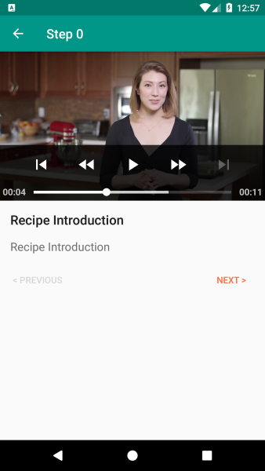
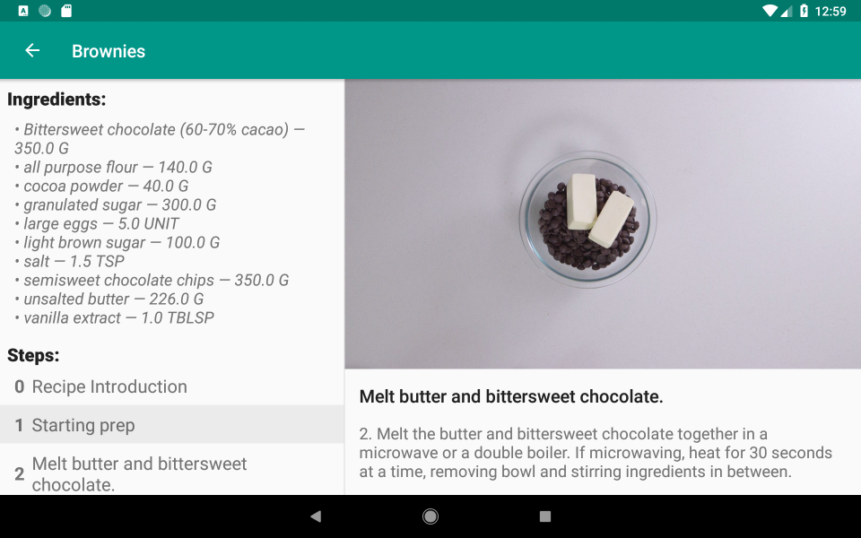

# BakingApp
Project Submission for Android Developer Nanodegree Program

## Screenshots

## Libraries
* [Android Support Library](https://developer.android.com/topic/libraries/support-library/)
* [Butter Knife](http://jakewharton.github.io/butterknife)
* [Espresso](https://developer.android.com/training/testing/espresso/)
* [Exoplayer](https://github.com/google/ExoPlayer)
* [GSON](https://github.com/google/gson)
* [Leak Canary](https://github.com/square/leakcanary)
* [LiveData](https://developer.android.com/topic/libraries/architecture/livedata)
* [Picasso](http://square.github.io/picasso)
* [Retrofit](http://square.github.io/retrofit/)
* [Room](https://developer.android.com/topic/libraries/architecture/room)
* [Timber](https://github.com/JakeWharton/timber)

## Credits
Icons made by [Darius Dan](https://www.flaticon.com/authors/darius-dan) from [Flaticon](www.flaticon.com) are licensed by [CC 3.0 BY](http://creativecommons.org/licenses/by/3.0/)

## License
See [LICENSE](./LICENSE) for details.
